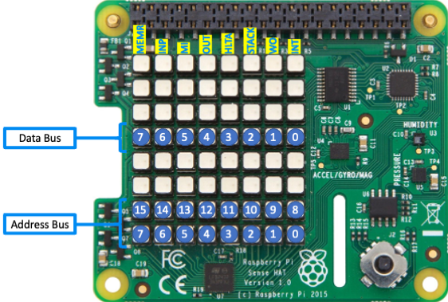
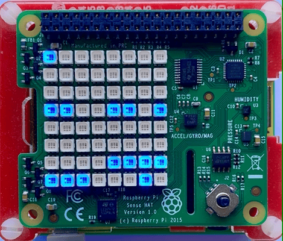
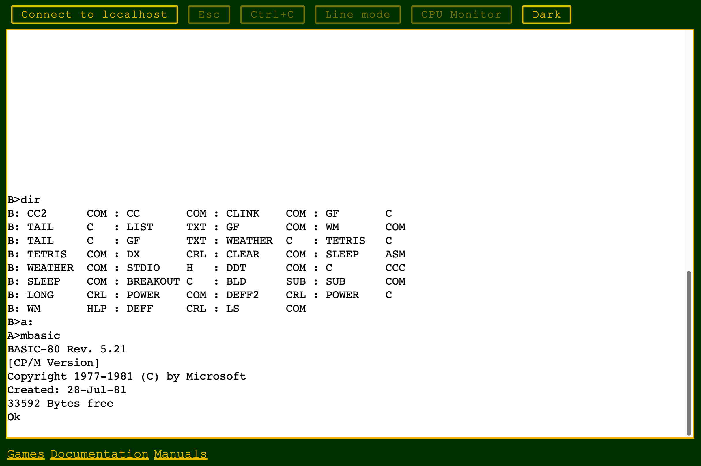

# Deploying the Altair 8800 Emulator with Docker

This guide explains how to start and configure the Altair 8800 emulator using Docker. The Altair emulator is a software recreation of the classic Altair 8800 computer, supporting CP/M and other retro environments. You can run it on Linux, macOS, Windows, and Raspberry Pi.

Below you'll find instructions for standard and advanced deployment modes, environment variable configuration, persistent disk storage, and useful Docker commands.

## Altair 8800 Standard Mode

This option is recommended for most users and works on 32-bit and 64-bit (recommended) versions of Linux, macOS, Windows, and Raspberry Pi.

```shell
docker run -d --user root -p 8082:8082 -p 8088:8080 --name altair8800 --rm glovebox/altair8800:latest
```

!!! note "Ports"

    - Port 8088 provides access to the Web Terminal interface
    - Port 8082 enables Altair emulator terminal I/O through a WebSocket connection.

## Altair 8800 Advanced Modes

You can enable advanced features by setting environment variables. These options can be combined as needed:

- Set the time zone.
- Connect to an MQTT broker to publish Altair address and data bus information.
- Integrate with OpenAI Chat Completions
- Connect to the Open Weather Map service for current weather data.
- Run on a Raspberry Pi with a Pi Sense HAT to display address and data bus info on the 8x8 LED panel.

### Docker Environment Variables

The Altair emulator supports several Docker environment variables. The easiest way to set these is with the env file `--env-file` option. You'll find a sample `altair.env` file in the [root folder](https://github.com/gloveboxes/Altair-8800-Emulator/blob/main/altair.env){:target=_blank} of this project. Create a copy of this file, modify it as needed and save it somewhere convenient and safe especially if it contains sensitive information like API keys.

Store your modified `altair.env` file in a secure location, especially if it contains sensitive information such as API keys. Open the `altair.env` file in a text editor and set the environment variables you want to use. Then, start the Altair emulator Docker container with the `--env-file` option.

#### Supported Environment Variables

| Variable                 | Description                                                               |
| ------------------------ | ------------------------------------------------------------------------- |
| TZ                       | Set the time zone (e.g., Australia/Sydney)                                |
| MQTT_HOST                | MQTT broker host                                                          |
| MQTT_PORT                | MQTT broker port (**default: 1883**)                                      |
| MQTT_CLIENT_ID           | Unique MQTT client ID                                                     |
| OPENAI_API_KEY           | OpenAI API Key                                                            |
| OPENAI_ENDPOINT          | OpenAI Endpoint (**default: https://api.openai.com/v1/chat/completions**) |
| OPEN_WEATHER_MAP_API_KEY | API key for Open Weather Map                                              |
| FRONT_PANEL              | Front panel type (sensehat, kit, none; **default: none**)                 |
| SLOW_CPU_ON_DISCONNECT   | Slow CPU on Browser Disconnect. Defaults to true and power saving mode.   |


```shell
docker run -d --env-file altair.env --user root -p 8082:8082 -p 8088:8080 --name altair8800 --rm glovebox/altair8800:latest
```

### Time Zone

Set the time zone with the `TZ=YOUR_TIME_ZONE` environment variable. For example, to set the time zone to Sydney, Australia, use `TZ=Australia/Sydney`. See the [list of time zones](https://en.wikipedia.org/wiki/List_of_tz_database_time_zones){:target=_blank} for your location.

### MQTT Broker

Connect to an MQTT broker to publish Altair address and data bus information. Set the following environment variables:

- MQTT_HOST=`YOUR_MQTT_HOST`
- MQTT_PORT=`YOUR_MQTT_PORT` (default: 1883)
- MQTT_CLIENT_ID=`YOUR_MQTT_CLIENT_ID` (must be unique for each client)

#### ThingsBoard

Telemetry data is sent to the MQTT topic `v1/devices/me/telemetry` in ThingsBoard format.
You can install the free ThingsBoard Community Edition locally, including on devices like a Raspberry Pi. See the [ThingsBoard installation guide](https://thingsboard.io/docs/user-guide/install/installation-options/){:target=_blank}.
In ThingsBoard, create an MQTT device to represent your Altair emulator. Use the same `MQTT_CLIENT_ID` when connecting from the Altair emulator.

### Open Weather Map

Connect to the Open Weather Map service for current weather information. Set:

- OPEN_WEATHER_MAP_API_KEY=`YOUR_OPEN_WEATHER_MAP_API_KEY` (get a free API key at [Open Weather Map](https://openweathermap.org/api){:target=_blank})

### OpenAI Chat Key

Configure your OpenAI API Key

- OPENAI_API_KEY

### OpenAI Endpoint

 - The default endpoint is **https://api.openai.com/v1/chat/completions**.
 - For LM Studio, use **http://IP_ADDRESS:1234/v1/chat/completions**. If Altair runs in a container, use the LM Studio server's IP address—not localhost—since localhost refers to the container itself.

### Raspberry Pi with Pi Sense HAT

You can run the Altair emulator on a Raspberry Pi with a Pi Sense HAT attached. The Pi Sense HAT 8x8 LED panel displays the Altair address and data bus information. For games, you can switch between *Font* and *bitmap* display modes.


You can switch between *Font* and *bitmap* display modes using the emulator's front panel controls or configuration options. Refer to the emulator documentation for specific instructions on changing display modes.

| Raspberry Pi with Pi Sense HAT                                                       | Raspberry Pi Sense HAT                                                                   |
| ------------------------------------------------------------------------------------ | ---------------------------------------------------------------------------------------- |
|  |  |

#### Enable the Pi Sense HAT

Set the front panel environment variable:

- FRONT_PANEL=`sensehat` (Options: sensehat, kit, none; default: none)

#### Enable I2C Hardware Access

Enable I2C hardware access and pass the `--device` option to the `docker run` command:

1. Enable I2C hardware access on the Raspberry Pi:

    ```bash
    sudo raspi-config nonint do_i2c 0
    ```

2. Pass the `--device` option to the `docker run` command:

    ```shell
    docker run -d --env-file ~/altair.env --privileged --device=/dev/i2c-1 --user root -p 8082:8082 -p 8088:8080 --name altair8800 --restart always glovebox/altair8800:latest
    ```

## Altair Disk Storage

Altair emulator disks can be stored in a Docker persistent storage volume. This ensures any changes made to the contents of the Altair disks are saved if the Docker container is stopped or deleted.

```shell
docker run -d --env-file ~/altair.env --privileged --device=/dev/i2c-1 -v altair-disks:/app/Disks --user root -p 8082:8082 -p 8088:8080 --name altair8800 --restart always glovebox/altair8800:latest
```

Or, pass environment variables using the environment file:

```shell
docker run -d -v altair-disks:/app/Disks --env-file altair.env --user root -p 8082:8082 -p 8088:8080 --name altair8800 --rm glovebox/altair8800:latest
```

## Open the Web Terminal

To access the Altair emulator, open the Web Terminal:


1. Familiarize yourself with the [Web Terminal](../20-fundamentals/25-Web-Terminal.md) and the CP/M operating system.
2. Open your web browser:
    - If running locally, go to `http://localhost:8088`.
    - If running remotely, go to `http://<hostname_or_ip_address>:8088`.

    

### Connecting to a Remote Altair Emulator

To connect your local Web Terminal to a remote Altair emulator, add the `altair` query parameter to the URL. For example, if the remote Altair emulator is running at `192.168.1.100`, open your browser and go to `http://localhost?altair=192.168.1.100`. This requires the Web Terminal to be running on your local machine, either in a separate Docker container or installed locally.

**Note:** The Web Terminal must be running locally (either in a separate Docker container or installed on your machine) to connect to a remote Altair emulator using the `altair` query parameter.

## Docker Tips and Tricks

### Manage the Altair Emulator Docker Container

**Stop the container:**

Stops the running Altair emulator container:
```bash
docker stop altair8800
```

**Restart the container:**

Restarts a previously stopped Altair emulator container:
```bash
docker start altair8800
```

**Delete the container:**

Removes the Altair emulator container after stopping it:
```bash
docker rm altair8800
```

### Manage Persistent Storage Volume

**Inspect the volume:**

```bash
docker volume inspect altair-disks
```

**Check data in the volume:**

```bash
sudo ls -al /var/lib/docker/volumes/altair-disks/_data
```

**Remove the volume:**

```bash
docker volume rm altair-disks
```
