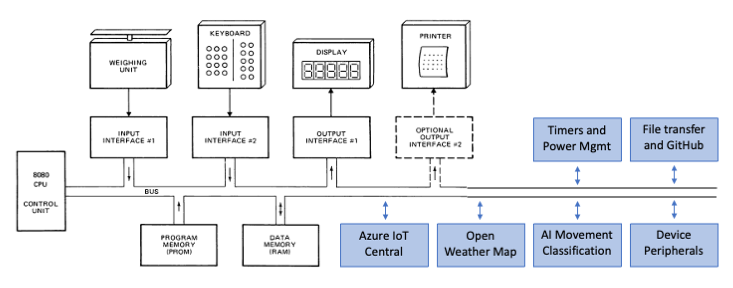

The Intel 8080 CPU can address up to 256 input ports and 256 output ports; allowing for virtually unlimited system expansion. Access to the ports is via the IN and OUT [Intel 8080 CPU instructions](https://github.com/AzureSphereCloudEnabledAltair8800/Altair8800.manuals/blob/master/8080asm.pdf){:target=_blank}, see page 38.

## Intel 8080 IO ports and peripherals



## Altair emulator software-enabled ports

The Altair emulator uses Intel 8080 IO ports to provide time services, random numbers, system information, file transfer, persistent environment variables, weather data, and an OpenAI-compatible chat client.

- You can access Intel 8080 IO ports from BASIC, C, and Assembly programming languages, and directly using Intel 8080 opcodes. See [Using Intel 8080 Input Output ports](#using-intel-8080-input-output-ports).
- I/O is routed by [port_drivers/io_ports.c](https://github.com/gloveboxes/esp32-altair-8800/blob/main/port_drivers/io_ports.c){:target=_blank} to per-feature drivers in the same folder (`time_io.c`, `utility_io.c`, `weather_io.c`, `files_io.c`, `environment_io.c`, `chat_io.c`).
- You can extend the Altair 8800 by adding additional IO port functions — drop a new `*_io.c` driver into `port_drivers/` and route the port range from `io_ports.c`.

### Altair Emulator IO Port SDK

Sample code in the `Apps/SDK` folder demonstrates how to call these IO ports from BDS C. See for example `DXENV.C` (environment variables) and `DXTERM.C` (terminal helpers). These examples are also useful references for LLM-assisted development.

### Response read port

Many ports return a multi-byte string. The convention is:

1. The CP/M program writes a request byte (or selector) to the output port for the feature.
2. The driver fills an internal response buffer and the program reads bytes from **port 200** until a NUL (`0x00`) is returned.

| Port | Direction | Description |
|------|-----------|-------------|
| 200  | IN        | Read next byte of the most recently loaded response. NUL terminates. |

### Timer ports (time_io)

| Port | Dir | Port data | Loads |
|------|-----|-----------|-------|
| 24 | OUT | 0-255 | Set timer 0 period high byte (milliseconds) |
| 25 | OUT | 0-255 | Set timer 0 period low byte (milliseconds) and start timer |
| 26 | OUT | 0-255 | Set timer 1 period high byte (milliseconds) |
| 27 | OUT | 0-255 | Set timer 1 period low byte (milliseconds) and start timer |
| 28 | OUT | 0-255 | Set timer 2 period high byte (milliseconds) |
| 29 | OUT | 0-255 | Set timer 2 period low byte (milliseconds) and start timer |
| 30 | OUT | 0-255 | Set seconds timer period and start timer |
| 24-29 | IN | -    | Query corresponding millisecond timer (non-zero while running, 0 when expired) |
| 30 | IN  | -         | Query seconds timer (non-zero while running, 0 when expired) |

### Stopwatch ports (time_io)

Passive elapsed-time counters with 1-second resolution. Unlike the countdown timers above, a stopwatch never expires — it simply measures the time since it was started. The elapsed value is returned as an unsigned 32-bit second count, emitted big-endian as 4 raw bytes (the BDS C `long` byte layout: MSB first) and read back via port 200.

| Port | Dir | Port data | Loads (read with port 200) |
|------|-----|-----------|----------------------------|
| 37 | OUT | 0 | Start/reset stopwatch 0 (records current time; no response) |
| 37 | OUT | 1 | Latch stopwatch 0 elapsed seconds as a 4-byte big-endian long |
| 38 | OUT | 0 | Start/reset stopwatch 1 (records current time; no response) |
| 38 | OUT | 1 | Latch stopwatch 1 elapsed seconds as a 4-byte big-endian long |
| 39 | OUT | 0 | Start/reset stopwatch 2 (records current time; no response) |
| 39 | OUT | 1 | Latch stopwatch 2 elapsed seconds as a 4-byte big-endian long |

```c
char elapsed[4];        /* BDS C long: elapsed[0] = MSB            */

outp(37, 0);            /* start stopwatch 0                       */
/* ... do some work ... */
outp(37, 1);            /* latch elapsed seconds                   */
elapsed[0] = inp(200);  /* read the 4-byte big-endian long back    */
elapsed[1] = inp(200);
elapsed[2] = inp(200);
elapsed[3] = inp(200);  /* elapsed now holds the seconds as a long */
```

### Wall clock and date ports (time_io)

The wall clock requires Wi-Fi and a successful SNTP sync. Before sync these ports return a `+<seconds>s` boot-relative fallback.

| Port | Dir | Port data | Loads (read with port 200) |
|------|-----|-----------|----------------------------|
| 41 | OUT | 0 | Seconds since boot, e.g. `12345` |
| 42 | OUT | 0 | UTC date/time, ISO 8601 (`YYYY-MM-DDTHH:MM:SSZ`) |
| 43 | OUT | 0 | Local date/time using configured timezone, ISO 8601 |
| 44 | OUT | 0 | Local long date, e.g. `Thursday, 21 May 2026` |

### Utility ports (utility_io)

| Port | Dir | Port data | Loads (read with port 200 unless noted) |
|------|-----|-----------|-----------------------------------------|
| 45 | OUT | 0   | Random number (2 bytes: low, high) on port 200 |
| 48 | OUT | 0   | Wi-Fi DHCP hostname string |
| 48 | OUT | 1   | Wi-Fi IPv4 address string |
| 48 | OUT | 2   | Device ID (MAC address) string |
| 49 | OUT | 0xA5 | **Reboot the ESP32.** Any other data byte is ignored. |
| 70 | OUT | 0   | Firmware version string, e.g. `ESP32-S3 Altair8800 (IDF v6.0.1)` |

### Weather ports (weather_io)

Requires an OpenWeatherMap API key and location set via the `ENV` app (keys `WEATHER_API_KEY`, `WEATHER_LOCATION`, `WEATHER_UNITS`). A background task refreshes data approximately every 20 minutes.

| Port | Dir | Port data | Loads |
|------|-----|-----------|-------|
| 46 | OUT | 0 | City |
| 46 | OUT | 1 | Current conditions main, e.g. `Rain` |
| 46 | OUT | 2 | Current conditions description |
| 46 | OUT | 3 | Current temperature |
| 46 | OUT | 4 | Current humidity |
| 46 | OUT | 5 | Current wind |
| 46 | OUT | 6 | Forecast main |
| 46 | OUT | 7 | Forecast description |
| 46 | OUT | 8 | Forecast temperature |
| 46 | OUT | 9 | Forecast valid-at time |
| 46 | OUT | 10 | Age of the last fetch in seconds |
| 47 | IN  | -  | Status: 0 = no data, 1 = fetching, 2 = ready, 3 = error |

Selected field is read byte-by-byte from port 200 until a NUL is returned.

### Remote file transfer ports (files_io)

The Altair emulator can pull files from a remote FT server (or from the bundled MCP server) over Wi-Fi. The `FT` CP/M command on drive B: wraps these ports.

| Port | Dir | Port data | Loads |
|------|-----|-----------|-------|
| 60 | OUT | 1 | `SET_FILENAME` — start a new filename transfer on port 61 |
| 60 | OUT | 3 | `REQUEST_CHUNK` — request next 256-byte data chunk |
| 60 | OUT | 4 | `CLOSE` — close the current transfer |
| 61 | OUT | ASCII | Filename character (NUL-terminated) |
| 60 | IN  | -  | Status: 0 = idle, 1 = data ready, 2 = EOF, 3 = busy, 255 = error |
| 61 | IN  | -  | Chunk byte (or leading count byte, per FT protocol) |

### Environment variable ports (environment_io)

Persistent key/value storage backed by ESP32 NVS. The `ENV` CP/M command and the `DXENV.C` SDK wrapper use these ports.

| Port | Dir | Port data | Loads |
|------|-----|-----------|-------|
| 71 | OUT | 0 | Reset request buffer |
| 71 | OUT | 1 | INIT — open NVS namespace |
| 71 | OUT | 2 | GET — request preceded by `key\0` on port 72; reply on port 200 |
| 71 | OUT | 3 | SET — request preceded by `key\0value\0` on port 72 |
| 71 | OUT | 4 | DELETE — request preceded by `key\0` on port 72 |
| 71 | OUT | 5 | LIST — list all key/value pairs on port 200 |
| 71 | OUT | 6 | COUNT — number of entries on port 200 |
| 71 | OUT | 7 | CLEAR — delete all entries |
| 71 | OUT | 8 | EXISTS — request preceded by `key\0` on port 72 |
| 71 | OUT | 9 | EXECUTE — run a CLI command line previously written to port 72 |
| 72 | OUT | ASCII | Append byte to request buffer |
| 71 | IN  | -  | Last status code: 0 = OK, -1 open, -2 read, -3 write, -4 full, -5 not found |

### OpenAI-compatible chat ports (chat_io)

Requires `CHAT_OPENAI_KEY` (and optionally `CHAT_OPENAI_URL`, `CHAT_OPENAI_MODEL`, `CHAT_SYSTEM_PROMPT`) set via the `ENV` app.

| Port | Dir | Port data | Loads |
|------|-----|-----------|-------|
| 120 | OUT | 0 | Trigger / start a request |
| 121 | OUT | ASCII | Append byte to the user request buffer |
| 122 | OUT | 0 | Reset response state for the next streaming read |
| 120 | IN  | -  | Trigger status (acknowledged) |
| 123 | IN  | -  | Stream status: 0 = EOF, 1 = waiting, 2 = data ready |
| 124 | IN  | -  | Next byte of streamed response when status = data ready |

## Using Intel 8080 Input Output ports

The following code snippets use the Intel 8080 IO ports. The code samples included on the CP/M boot disk expand on these snippets.

### Assembler access to Intel 8080 IO Ports

The following assembly code demonstrates the use of the Intel 8080 IO port 30 timer. The code sets a 2-second delay, and then waits for the timer to expire. This is a snippet of the **SLEEP.ASM** sample included on drive B: of the Altair emulator.

```asm
      ORG 0100H   ;CP/M base of TPA (transient program area)
      MVI A,2     ;Move 2 to the accumulator to set a 2 second delay
      OUT 30      ;Start timer
LOOP: IN 30       ;Get delay timer state into the accumulator
      CPI 00H     ;If accumulator equal to 0 then timer has expired
      JZ BACK     ;Jump on zero
      JMP LOOP
BACK: RET
```

### BSD C access to Intel 8080 IO Ports

The following C code demonstrates the use of the Intel 8080 IO port 30 timer. The code sets a 1-second delay, and then waits for the timer to expire. This is a snippet of the **HW.C** sample included on drive B: of the Altair emulator.

```c
outp(30,1);      /* Enable delay for 1 second */
while(inp(30));  /* Wait for delay to expire */
```

#### Front panel: reboot the ESP32 in binary

You can also drive ports directly from the Altair front panel (physical kit or the web virtual console) by toggling raw opcodes into memory. The four bytes below load `0xA5` into the accumulator, write it to port 49, and halt — which causes the ESP32 to restart.

| Addr | Hex | Binary    | Mnemonic       | Meaning |
|------|-----|-----------|----------------|---------|
| 0000 | 3E  | 0011 1110 | `MVI A, data`  | Load next byte into A |
| 0001 | A5  | 1010 0101 | data           | The reboot magic byte (0xA5) |
| 0002 | D3  | 1101 0011 | `OUT port`     | Output A to next byte's port |
| 0003 | 31  | 0011 0001 | port           | Port 49 (`31h`) — reboot |
| 0004 | 76  | 0111 0110 | `HLT`          | Halt (never reached; ESP32 resets) |

Front panel sequence:

1. Set the address switches to `0000 0000 0000 0000` and press `EXAMINE`.
2. For each of the five bytes above, set the data switches to the binary value and press `DEPOSIT NEXT` (the first byte uses plain `DEPOSIT`).
3. Set address back to `0000 0000 0000 0000`, press `EXAMINE`, then `RUN`.

The ESP32 reboots almost immediately after the `OUT 31h` is executed.

> **Tip:** the same reboot is available without toggling switches by running the `ENV` app on CP/M drive A: and choosing the `R` (Reboot) menu option.

### BASIC access to Intel 8080 IO Ports

The following BASIC code demonstrates the use of the Intel 8080 IO port 30 timer. The code sets a 1-second delay, and then waits for the timer to expire. This is a snippet of the **COUNT.BAS** sample included on drive A: of the Altair emulator.

#### Delay IO ports

```basic
900 REM This sleep subroutine sleeps or delays for 1 second
1000 OUT 30, 1
1100 WAIT 30, 1, 1
1200 RETURN
```

#### Weather IO ports

The following BASIC code selects the current temperature field on port 46 and then reads the string from port 200 byte-by-byte until a NUL is returned. The OpenWeatherMap API key and location must be configured first using the `ENV` CP/M app.

```BASIC
500 PORT = 46 : REM Weather field selector port
510 PDATA = 3 : REM 3 = current temperature
520 GOSUB 4800 : REM Loads the field, then reads it as a string
530 PRINT RSTRING$
540 END

4800 REM SUBROUTINE READS STRING DATA FROM PORT UNTIL NULL CHARACTER
4900 OUT PORT, PDATA
5000 RSTRING$ = ""
5100 C=INP(200) : REM Read characters until NULL returned
5200 IF C = 0 THEN RETURN
5300 RSTRING$ = RSTRING$ + CHR$(C)
5400 GOTO 5100
```

#### System info IO ports

The following BASIC reads the device's Wi-Fi IP address (port 48 selector 1):

```basic
100 OUT 48, 1
110 S$ = ""
120 C = INP(200)
130 IF C = 0 THEN GOTO 200
140 S$ = S$ + CHR$(C)
150 GOTO 120
200 PRINT "IP = "; S$
```

#### Reboot the ESP32

CP/M cannot rebuild the host on its own — port 49 with the magic byte `0xA5` (165 decimal) triggers an `esp_restart()`. Any other data byte is ignored, so accidental writes are safe.

```c
outp(49, 0xA5);   /* Reboot the ESP32 after the current OUT completes. */
```

```basic
10 OUT 49, 165   : REM 0xA5 — reboot the ESP32
```

The `ENV` CP/M app exposes this as the `R` (Reboot) menu option with a `y/N` confirmation prompt.
