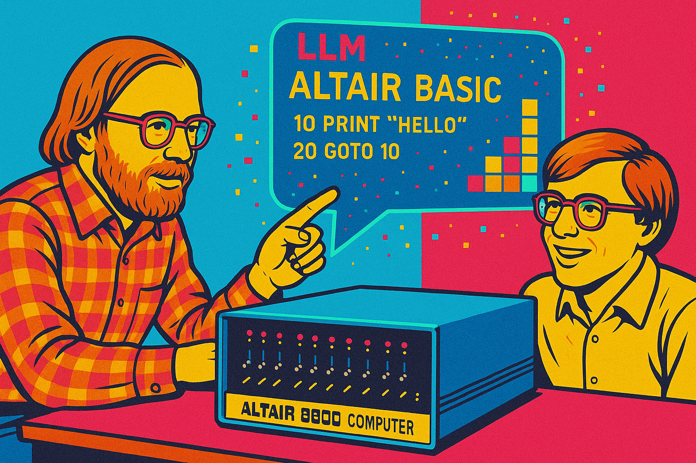

The goal of the **Altair 8800 AI Edition** is to blend the old with the latest AI developments &mdash; vibe engineering the [Altair 8800](https://en.wikipedia.org/wiki/Altair_8800?azure-portal=true){:target=_blank} platform for the ESP32-S3, Linux/macOS, Windows, and Docker. You'll learn about computing fundamentals, software development, and how to guide modern AI tools to write code for a 1970s microcomputer using a combination of Skills, MCP Servers, and Python-based symbol checking.

Along the way you'll discover that you still have to think through the problems and guide models towards preferred architectures that maximise limited resources &mdash; a great way to flex your dev skills and learn best-practice microcontroller development.

The [Altair 8800](https://en.wikipedia.org/wiki/Altair_8800?azure-portal=true){:target=_blank} kick-started the personal computer revolution. Microsoft's first product was [Altair BASIC](https://en.wikipedia.org/wiki/Altair_BASIC?azure-portal=true){:target=_blank} written for the Altair 8800 by Bill Gates and Paul Allen. At the time, Altair BASIC was a huge step forward as it allowed people to write programs using a high-level programming language.

<!-- ## Get started docs

Head to [Get started](/start/Deploy){:target=_blank} to learn how to deploy and run the Altair 8800 emulator. -->

The Altair project provides a fun way to learn:

1. [Vibe engineer](https://en.wikipedia.org/wiki/Vibe_coding){:target=_blank} Altair 8800 applications using Intel 8080 Assembly, BDS C, and Microsoft BASIC, with help from Large Language Models (LLMs) such as Claude Sonnet or OpenAI Codex, in VS Code with GitHub Copilot.
2. Learn to build multithreaded, event-driven IoT C applications that scale from [microcontrollers](https://en.wikipedia.org/wiki/Microcontroller){:target=_blank} and [Raspberry Pis](https://en.wikipedia.org/wiki/Raspberry_Pi){:target=_blank} to desktop-class computers.
3. Safely explore machine-level programming, including Intel 8080 Assembly, C, and BASIC development.
4. Enjoy retro gaming and play classic games from the past.
5. Optionally, integrate free weather and pollution cloud services from [Open Weather Map](http://openweathermap.org){:target=_blank} and [ThingsBoard](https://thingsboard.io/){:target=_blank} for telemetry and control.
6. Optionally, stream telemetry data to the `ThingsBoard` MQTT Broker or a standalone Mosquitto MQTT Broker.

## Retro computing with Dave Glover and the Altair 8800

<iframe width="100%" height="420" src="https://www.youtube.com/embed/fSz5lTaXS0E" title="YouTube video player" frameborder="0" allow="accelerometer; autoplay; clipboard-write; encrypted-media; gyroscope; picture-in-picture" allowfullscreen></iframe>

## Supported platforms

The Altair emulator runs in three main ways:

1. **ESP32-S3 microcontroller boards** &mdash; the primary, most interesting target. The emulator runs natively on ESP32-S3 boards with a physical Altair front panel, VT100 or TFT LCD display output, SD-card disk storage, WiFi, and a WebSocket browser terminal.
2. **Desktop** &mdash; compile and run the emulator natively on [POSIX](https://en.wikipedia.org/wiki/POSIX){:target=_blank} compatible operating systems including Linux, ChromeOS, Windows with [WSL 2](https://docs.microsoft.com/en-us/windows/wsl/install){:target=_blank}, and macOS on Apple Silicon and Intel.
3. **Docker** &mdash; the **fastest** and **easiest** way to get going. Run the emulator in a container on Linux, macOS, Windows, ChromeOS, and Raspberry Pi OS, including single-board computers like the [Raspberry Pi](https://www.raspberrypi.org/){:target=_blank}. You'll be up and running in minutes.

### ESP32-S3 with the Altair front panel

The ESP32-S3 build drives a physical Altair front panel, mirroring the address and data bus activity just like the original hardware.

> More images of the ESP32-S3 VT100 terminal and the ESP32-S3 TFT LCD front panel are coming soon.

## Altair history

[Altair 8800 image attribution - Smithsonian Museum](https://commons.wikimedia.org/wiki/File:Altair_8800,_Smithsonian_Museum.jpg){:target=_blank}

The Altair 8800 was built on the [Intel 8080](https://en.wikipedia.org/wiki/Intel_8080?azure-portal=true){:target=_blank} CPU, the second 8-bit microprocessor manufactured by Intel in 1974. By today's standards, it's a simple CPU design, perfect for learning computing fundamentals because of its small instruction set.

The original Altair 8800 was programmed by setting switches on the front panel. It was a painstaking, error-prone process to load and run a program. The Altair 8800 had a series of LEDs and switches that you used to load apps and determine the state of the Altair.

You could save and load applications from a paper tape reader connected to the Altair 8800. As the Altair 8800 grew in popularity, more options became available. You could attach a keyboard, a computer monitor, and finally disk drives, a more reliable way to save and load applications.
